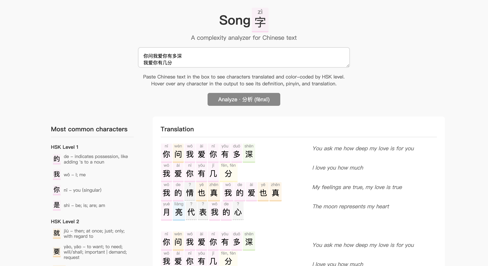

# Songzi
A Chinese text complexity analyzer that color-codes characters by HSK level and provides instant translations. This project was made with the Google Translate API, the pinyin-pro JavaScript library, [glxxyz/hskhsk.com](https://github.com/glxxyz/hskhsk.com), and HTML/CSS.

*User interface analyzing Teresa Teng's hit single, ["The Moon Represents My Heart"](https://en.wikipedia.org/wiki/The_Moon_Represents_My_Heart)*

## Data
- The Google Translate API was used for Chinese-to-English translation, with default pinyin lookups cached for performance.
- The Web Speech API was used to read input text aloud.
- Official HSK 1-6 lists and definitions were sourced from the GitHub repo [glxxyz/hskhsk.com](https://github.com/glxxyz/hskhsk.com).
- Accurate Chinese pinyin conversion and processing is done using v3.12 of [pinyin-pro](https://pinyin-pro.cn/en/), a JavaScript library.

## Usage

1. Paste any Chinese text in the input box
2. Click "Analyze" to process the text
3. View color-coded characters with HSK levels
4. Hover over characters for detailed information
5. See English translations aligned with Chinese text
6. Click the speaker icons next to Chinese lines to hear pronunciation

## Features

- **HSK Level Analysis**: Characters are color-coded by difficulty level (HSK 1-6)
- **Instant Translation**: Automatic translation of Chinese text to English via the Google Translate API
- **Interactive Tooltips**: Hover over any character to see pinyin and definition
- **Text-to-Speech**: Click speaker icons to hear Chinese text pronounced aloud using the Web Speech API
- **Mobile Responsive**: Optimized layout for desktop and mobile devices
- **Fast Performance**: All Chinese text displays immediately, translations load in parallel
